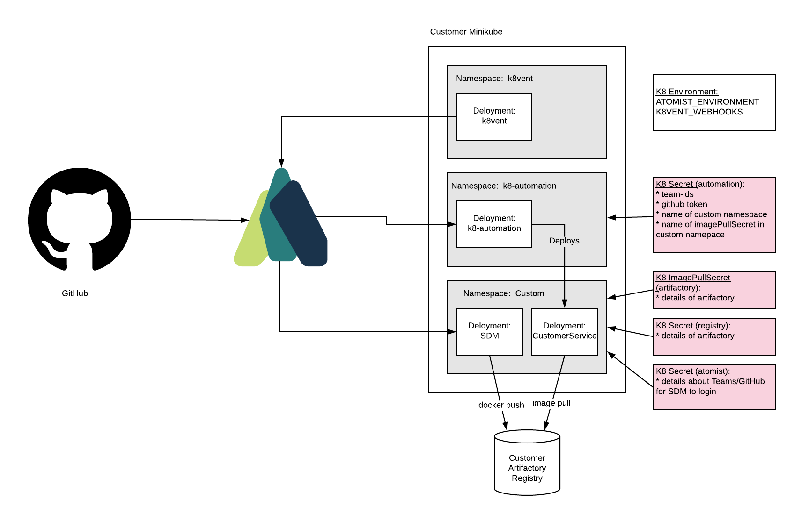
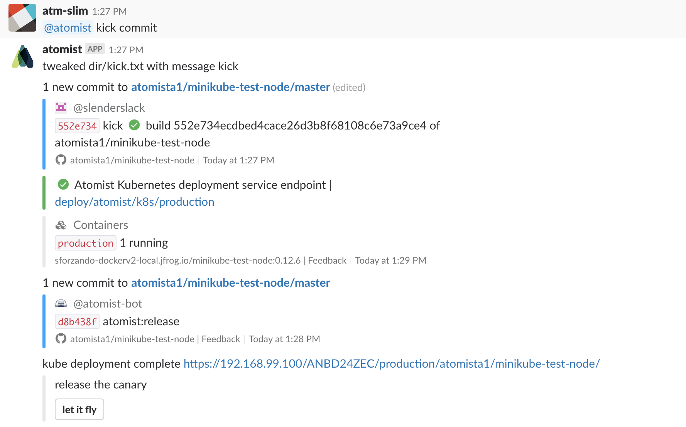

## Background on Demo

* Customer will manually configure Atomist webhooks on a private Repo containing a Node.js project
* Atomist will not be authorized to use this Repo.  Instead, a GitHub token will be created in a kubernetes in the Customer MiniKube environment.
  Atomist Automation will clone this Repo inside of Minikube running on the customer environment.
* Automation will create new Docker Images and write into the customer Docker Registry (Artifactory)
* Artifactory credentials are also configured using a kubernetes secret on the customer minikube
* Atomist delivery machine will detect Pushes, build containers, and update k8 deployments of customer
  microservices in the minikube.

### Secrets

Since the customer will be building their own private repos, but will not be using our OAuth
support in this phase, they will be adding creds as kubernetes secrets (we will use
both generic and image pull secrets).



There are several critical things that are supplied through k8 secrets:

* Atomist workspace ID is required by the k8-automation and the SDM, and is indirectly
  required by k8vent as it's part of the webhook url that it will send events to
* A GitHub personal token with at least `repo` and `read:org` scopes, is required by both
  the k8-automation and the SDM.  This requirement is partly a function of the fact that
  users will no be authorizing Atomist.  Post-demo, GitHub tokens could be replaced entirely by
  Atomist api tokens, and runtime OAuth tokens would be provided using org_token lookups.
* Artifactory credentials are required by both the SDM (to push images) and also in the form
  of an image pull secret, since our automation will be pulling images from this registry.
  This seems a bit complex but it means that the docker image building and and k8-automation
  don't have to be in the same minikube, which will typically be the case in non-demo scenarios.

### Adding a Docker Image Automation

```
kubectl create -f https://raw.githubusercontent.com/atomisthq/micro-srv-automation/master/assets/kube/namespace.yaml

kubectl --namespace=k8-automation create secret generic automation \
        --from-literal=config='{"teamIds":["ANBD24ZEC"],"token":"XXXXXXXX","custom":{"hostUrl":"https://192.168.99.100","imagePullSecret":"artifactory","namespace":"splunk"}}'

kubectl --namespace=splunk create secret generic registry \
        --from-literal=registry=sforzando-dockerv2-local.jfrog.io \
        --from-literal=username=jim \
        --from-literal=password=XXXXXXX \
        --from-literal=email=jim@atomist.com \

kubectl --namespace=splunk create secret generic atomist \
        --from-literal=team=ANBD24ZEC --from-literal=token=XXXXXXXXX

kubectl --namespace=splunk create -f https://raw.githubusercontent.com/atomisthq/micro-srv-automation/master/assets/kube/deployment.yaml
```

## Workflow

* Customer will do Pushes to private Node repo
* Atomist will pick up new Push and
    * start generic build
    * create new Container Images
    * finish generic build
    * link Image to Push
    * tag release
    * upsert kuberenetes Deployment
    * upsert kubernetes Service (only port 8080 is supported)
    * upsert ingress rule making new service available for consumption (url to service
      will be written into slack)


[in lucid charts](https://www.lucidchart.com/documents/edit/3f42dede-5a3c-4b84-bca8-322e4e2ac6cf/1)

We should be able to repeat this exact procedure for any number of Node.js repositories with zero
additional config.  This is an important aspect of the overall procedure because
we are building a machine for delivering any Node.js project from any repo into this
minikube environment.  Additional Services do not require additional config of any kind.

## Commits to Repo during Container Build

We will do a Commmit to the Repo to store a version.txt file containing the updated
version of the Container.  This Commit is marked as being an `atomist:release` so this
Commit will not trigger any downstream activity by Atomist.

## Requirements on Node.js project

The only requirement on the Node.js GitHub repos are:

1.  the GitHub token configured in the Secrets section must have read/write access to this repository.
    Write access is there so that we can increment the version of the project (best practice)
2.  the root of the Repo must contain a `build.sh` in the root directory.  This is responsible
    for calling the docker build.  If the `build.sh` writes an image.txt file, we will
    assume this contains the image that as been pushed.  Otherwise, we will look at the
    most recently pushed image.

Here's an example of a script that has been tested with this process:

```
IMAGE=$DOCKER_REGISTRY/minikube-test-node:$1
docker build -t $IMAGE -f docker/Dockerfile .
echo $IMAGE > image.txt
```

There are three things to note here:

1.  we will pass in one argument (a semantic version that will have the patch release incremented each time the build runs)
2.  the exit code of the script should be zero if it was successful
3.  writing out the image that was built to a file named `image.txt` ensures that docker image names can be something that unconventional :)

This uses a [bare bones Dockerfile](https://raw.githubusercontent.com/atomista1/minikube-test-node/master/docker/Dockerfile):

```
FROM node:carbon
WORKDIR /usr/src/app
copy package*.json ./
RUN npm install
COPY . .
EXPOSE 8080
CMD ["npm", "start"]
```

The `build.sh` is to ensure that the customer can use whatever Dockerfile is already present in the
project.  However, if there are some standards we can follow to remove this requirement, we can
discuss including processing Repos that do not contain Dockerfiles or build.sh scripts.  That
is a simple extension of this model if it is appropriate.

Here is a [sample repo](https://github.com/atomista1/minikube-test-node).
